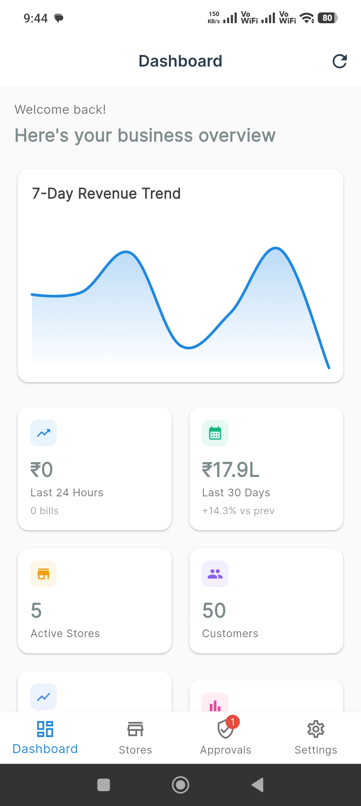
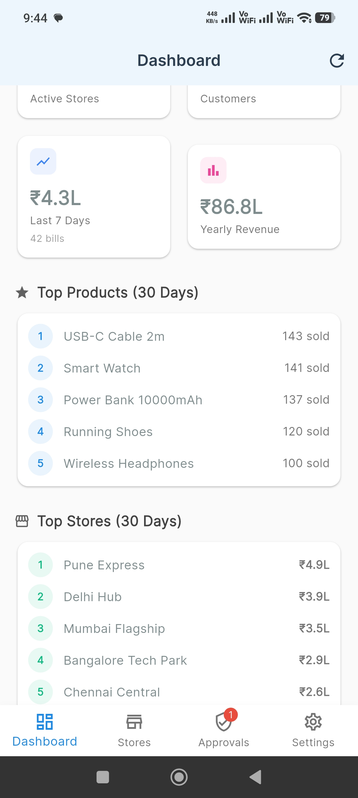
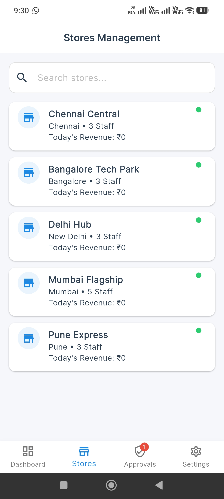
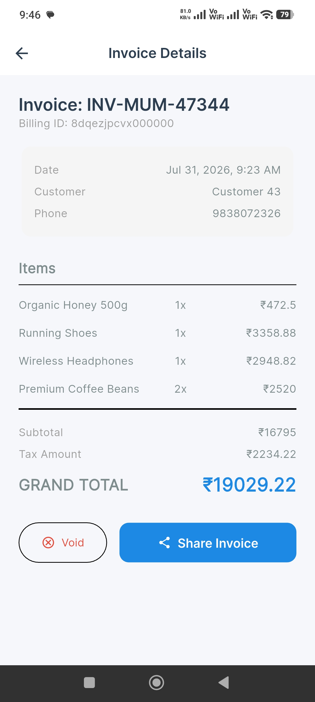
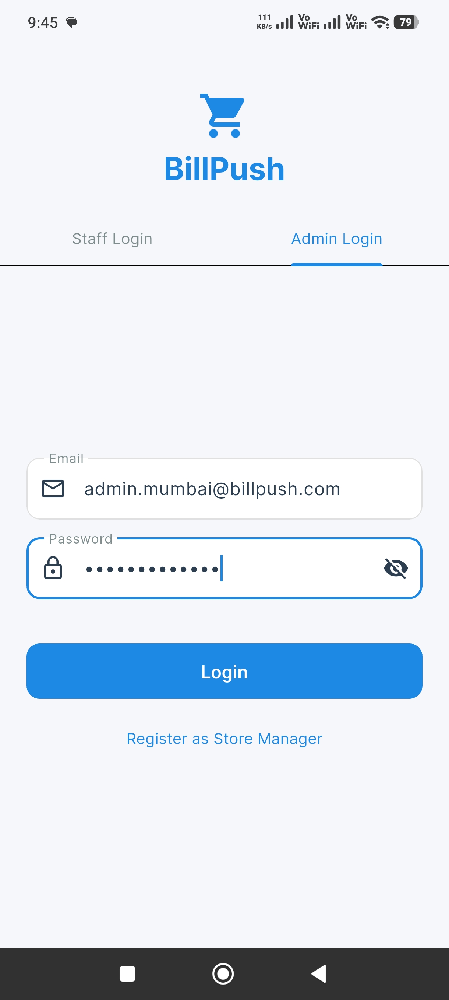
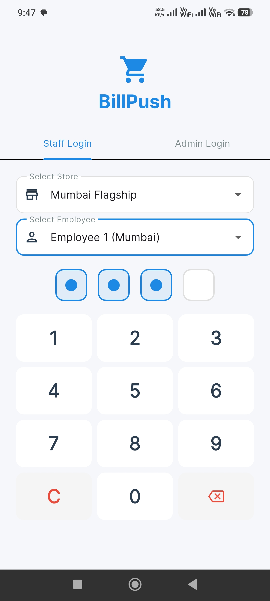
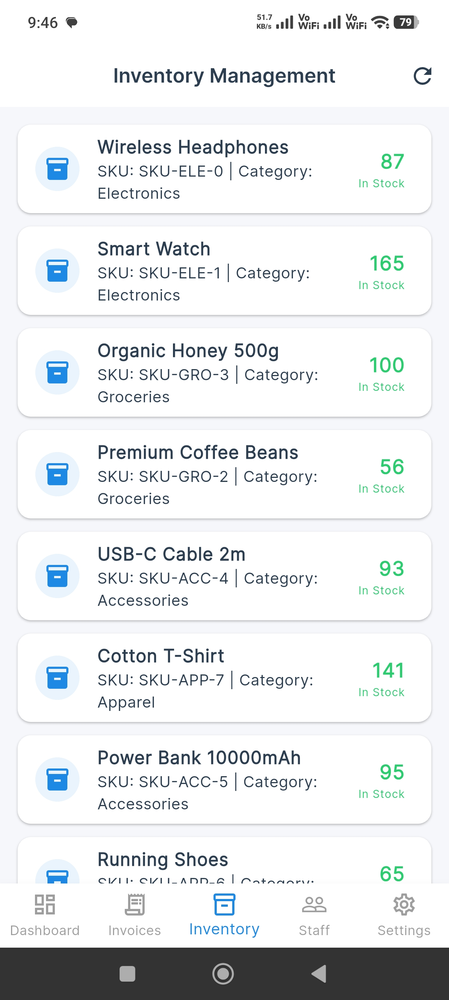
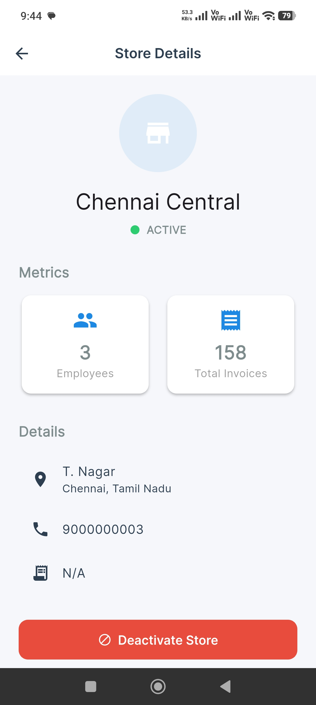
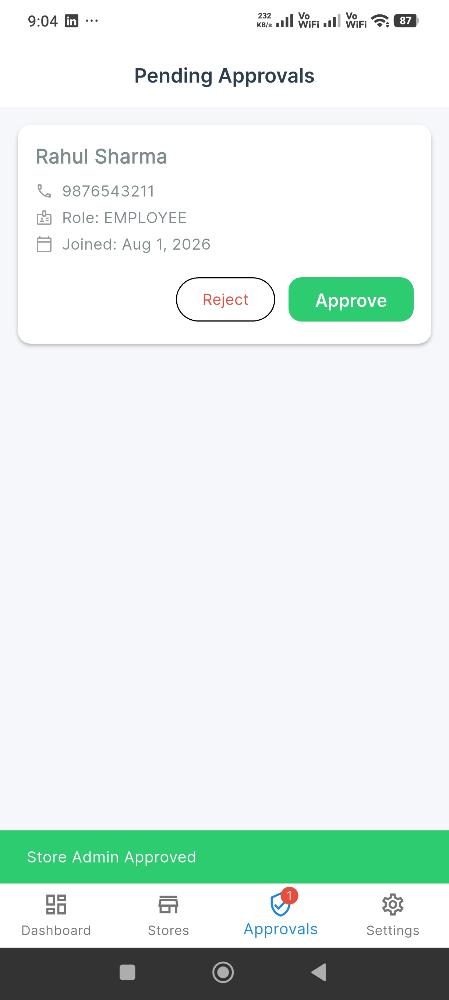
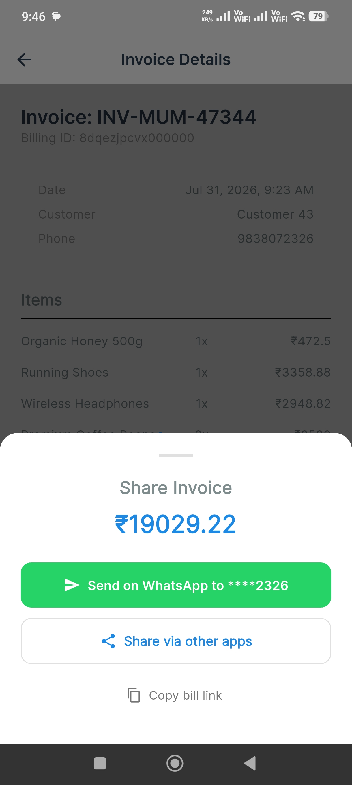

<div align="center">
  

  # BillPush
  
  **Omni-Channel Digital Invoice & Retail CRM Platform**

  <p>
    
    
    
    
  </p>

  <p>
    BillPush is a complete point-of-sale system for Android. Manage inventory, track staff, generate invoices, and view real-time analytics — all from a single app.
  </p>
</div>

---

## 📱 Application Screenshots

<table align="center">
  <tr>
    <td></td>
    <td></td>
    <td></td>
    <td></td>
  </tr>
  <tr>
    <td></td>
    <td></td>
    <td></td>
    <td></td>
  </tr>
  <tr>
    <td colspan="2" align="center"></td>
    <td colspan="2" align="center"></td>
  </tr>
</table>

---

## ✨ Features

- **⚡ Lightning Fast POS**: Ring up customers in seconds. Search products, apply discounts, and generate invoices all from your phone.
- **☁️ Real-time Cloud Sync**: Every sale, every stock update instantly synced across all devices. Powered by Supabase PostgreSQL.
- **👥 Staff & Roles**: Create unique PINs for employees. Restrict access with role-based permissions for Admin, Cashier, and Manager.
- **📦 Smart Inventory**: Track stock levels in real-time. Get automatic low-stock alerts. Manage product variations with ease.
- **📄 Digital Invoices**: Generate professional GST-compliant invoices. Share via WhatsApp, email, or print on thermal printers.
- **📈 Live Analytics**: Revenue trends, top products, store comparisons — all visualized in a dashboard updated in real-time.

---

## 🏗️ Architecture & Tech Stack

BillPush is engineered with a modern, scalable developer stack:

### Mobile Frontend (`/mobile`)
- **Framework**: Flutter (Dart)
- **State Management**: Riverpod
- **Local Storage**: Hive & SharedPreferences
- **Routing**: GoRouter

### Backend API (`/backend`)
- **Framework**: NestJS (TypeScript)
- **Database**: PostgreSQL (via Supabase)
- **ORM**: Prisma
- **Auth & Caching**: JWT tokens with Managed Redis
- **Storage**: AWS S3 for media uploads

### Landing Page (`/landing`)
- **Stack**: Pure HTML5, CSS3, Vanilla JS
- **Styling**: Custom CSS variables with a modern, responsive fintech SaaS aesthetic

---

## 🚀 Getting Started Locally

### 1. Backend Setup
```bash
cd backend
npm install
# Set up your .env file with DATABASE_URL, DIRECT_URL, REDIS_URL, JWT_SECRET
npx prisma generate
npx prisma db push
npm run start:dev
```

### 2. Mobile App Setup
```bash
cd mobile
flutter pub get
# Update lib/config/constants.dart with your local backend URL
flutter run
```

---

## 🌐 Production Deployment (Render)

This backend is pre-configured to be deployed natively on [Render](https://render.com/) utilizing cloud databases. The legacy Docker configuration has been removed to ensure seamless scalability.

### Prerequisites
1. **Supabase (PostgreSQL)**: Create a project on Supabase. Note down both the **Transaction URL** (Port 6543, used for connection pooling) and the **Session URL** (Port 5432, used for Prisma migrations).
2. **Managed Redis**: Create a Redis database (e.g., using Upstash or Render's Redis add-on).
3. **AWS S3**: You will need S3 bucket credentials for media uploads.

### 1-Click Deploy
The repository includes a `render.yaml` Blueprint file. 
1. Go to your Render Dashboard -> **Blueprints** -> **New Blueprint Instance**.
2. Connect this repository.
3. Render will automatically detect the `billpush-backend` web service.
4. Fill in the requested Environment Variables:
   - `DATABASE_URL`: Your Supabase Transaction Pooler URL (`pgbouncer=true`).
   - `DIRECT_URL`: Your Supabase Session URL.
   - `REDIS_URL`: Your Managed Redis connection string.
   - `JWT_SECRET`: A strong secret key.
   - S3 configuration keys.

Render will automatically run `npm install`, generate Prisma clients, run your production migrations (`prisma migrate deploy`), and start the NestJS server.

---

<div align="center">
  <h3>Built by Farhan Sayed</h3>
  <p>AI & Full Stack Engineer specializing in modern scalable systems.</p>
  <p>
    🌐 <a href="https://farhanbuilds.in">farhanbuilds.in</a> | 
    ✉️ <a href="mailto:farhanbuilds16@gmail.com">farhanbuilds16@gmail.com</a> | 
    🐙 <a href="https://github.com/FarhanSayed16">GitHub</a>
  </p>
</div>
