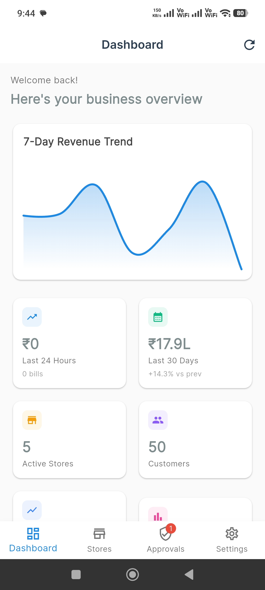
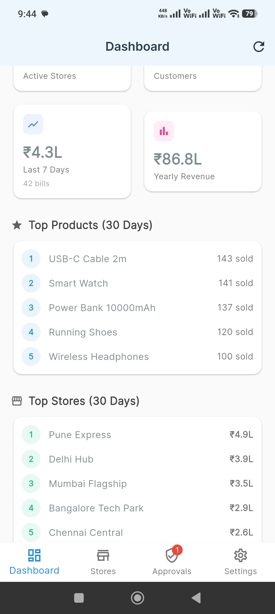
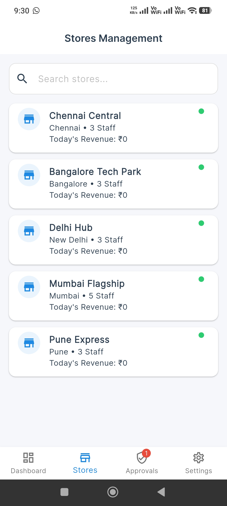
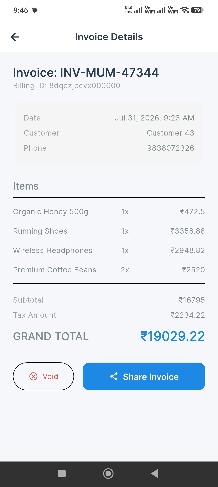
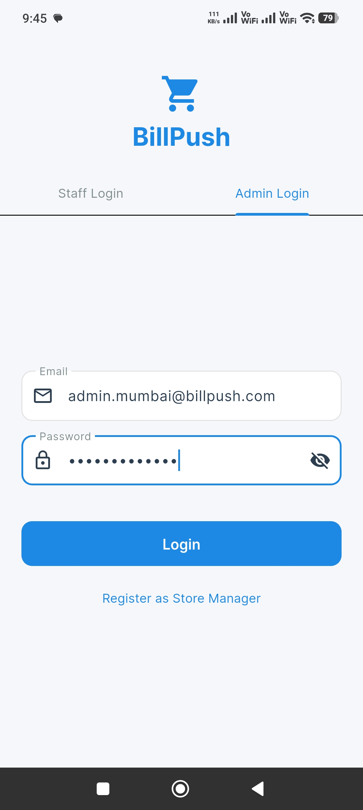
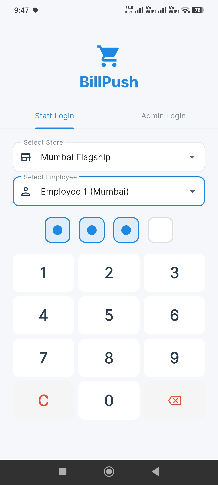
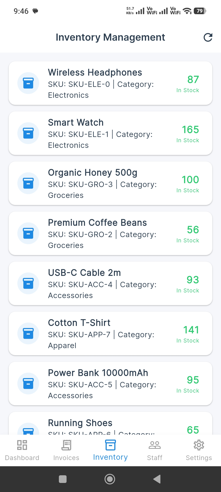
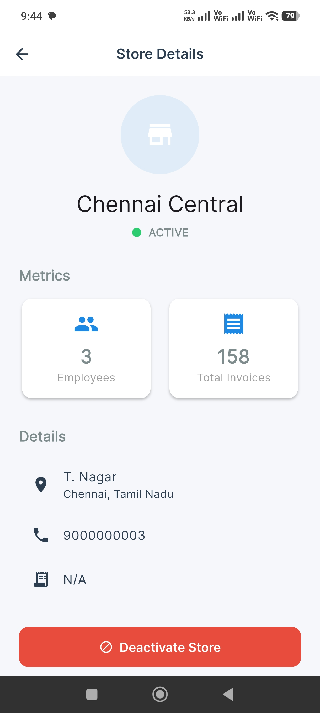

<div align="center">
  

  # BillPush
  
  **Mobile POS, digital invoices, and retail CRM**

  <p>
    
    
    
    
  </p>

  <p>
    BillPush is an Android-first point-of-sale system: ring up sales, manage inventory and staff, share invoices via WhatsApp/device share, and look up bills on the customer web portal.
  </p>
</div>

---

## Application Screenshots

<table align="center">
  <tr>
    <td></td>
    <td></td>
    <td></td>
    <td></td>
  </tr>
  <tr>
    <td></td>
    <td></td>
    <td></td>
    <td></td>
  </tr>
</table>

---

## About

BillPush helps small multi-store retailers run billing from Android phones. Staff create invoices, inventory decrements on catalog sales, returns flow through store admin approval, and customers can open a bill link on the web portal.

Data lives in PostgreSQL (commonly hosted on Supabase) behind a NestJS API.

---

## Key features (shipped)

- **POS billing** — customer entry, cart, discounts, loyalty redeem, PDF + share sheet / WhatsApp
- **Roles** — `SUPER_ADMIN`, `STORE_ADMIN`, `EMPLOYEE` (PIN login)
- **Inventory** — per-store stock adjust; sales decrement when `product_id` is present
- **Returns & loyalty** — pending approvals, points earn/redeem/expiry cron
- **Analytics** — revenue charts and CSV export for admins
- **Customer portal** (`/web`) — lookup by billing ID or phone
- **Offline queue** — bills saved locally when offline and synced when back online

### Not shipped yet (do not market as live)

- Bluetooth thermal printing
- Server-side email delivery
- Meta WhatsApp Cloud API automation
- Product variations matrix
- Payment gateway (UPI/cards)
- Customer OTP portal login

See [docs/KNOWN_LIMITATIONS.md](docs/KNOWN_LIMITATIONS.md) and [docs/SOFT_LAUNCH_CHECKLIST.md](docs/SOFT_LAUNCH_CHECKLIST.md).

---

## Architecture

| App | Path | Stack |
|-----|------|--------|
| Mobile POS | `/mobile` | Flutter, Riverpod, GoRouter, Hive |
| API | `/backend` | NestJS, Prisma, PostgreSQL, Redis, S3 |
| Customer portal | `/web` | Next.js |
| Marketing | `/landing` | Static HTML/CSS/JS |

---

## Getting started

### Backend
```bash
cd backend
cp .env.example .env   # set DATABASE_URL, DIRECT_URL, REDIS_URL, JWT_SECRET
npm install
npx prisma generate
npx prisma migrate deploy
npm run start:dev
```
API: `http://localhost:3000/api` · Health: `GET /api/health` · Swagger: `/api/docs`

### Mobile
```bash
cd mobile
flutter pub get
# Point lib/config/constants.dart baseUrl at your API (.../api)
flutter run
```

### Customer portal
```bash
cd web
cp .env.example .env.local   # NEXT_PUBLIC_API_URL=http://localhost:3000/api
npm install
npm run dev
```

### Landing
```bash
npx serve landing
```

---

## Docs

| Doc | Purpose |
|-----|---------|
| [docs/SPRINT_IMPLEMENTATION_PLAN.md](docs/SPRINT_IMPLEMENTATION_PLAN.md) | Phase/sprint plan |
| [docs/AUDIT_FIXES_AND_IMPROVEMENTS.md](docs/AUDIT_FIXES_AND_IMPROVEMENTS.md) | Full audit backlog |
| [docs/MASTERPLAN.md](docs/MASTERPLAN.md) | Product plan (canonical-ish) |
| [docs/KNOWN_LIMITATIONS.md](docs/KNOWN_LIMITATIONS.md) | Pilot limitations |
| [docs/SOFT_LAUNCH_CHECKLIST.md](docs/SOFT_LAUNCH_CHECKLIST.md) | Soft-launch QA |
| [docs/HISTORICAL.md](docs/HISTORICAL.md) | Stale / aspirational docs index |

---

<div align="center">
  <h3>Built by Farhan Sayed</h3>
  <p>
    🌐 <a href="https://farhanbuilds.in">farhanbuilds.in</a> |
    ✉️ <a href="mailto:farhanbuilds16@gmail.com">farhanbuilds16@gmail.com</a> |
    🐙 <a href="https://github.com/FarhanSayed16">GitHub</a>
  </p>
</div>
